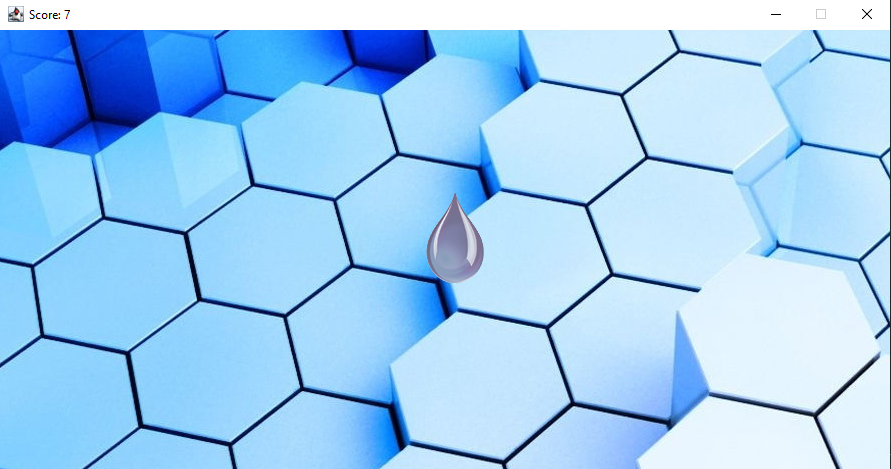

# Simple desktop Java game "Catch the drop"

GeekBrains intensive: simple Java game "Catch the drop"

  

Очень простая Java игра - "Поймай каплю" по интенсиву GeekBrains с использование Swing.

**Основные характеристики:**
- Скорость падающих увеличивается.
- Подсчитываются очки (в заголовке окна).
- Капля появляется в случайном месте по оси X.